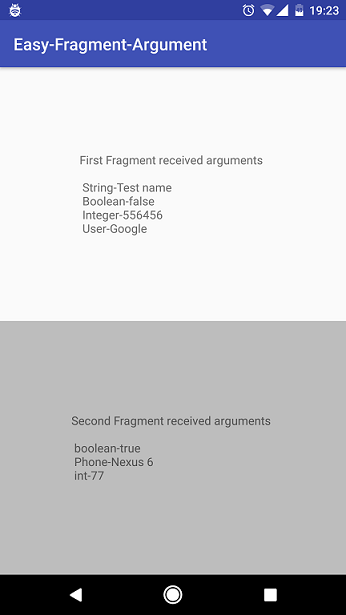
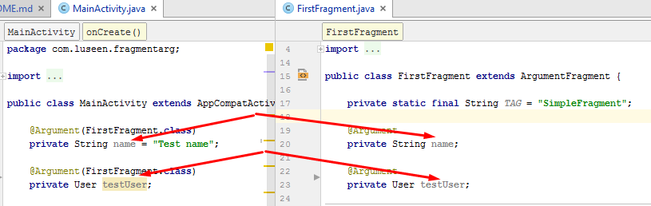

# Easy-Fragment-Argument

This library will help you to pass and receive fragment arguments in easier way<br /><br />
<br />

## Features

###Support types<br />
**String**<br />
**Boolean(boolean)**<br />
**Integer(int)**<br />
**Parcelable**<br />
**Serializable**<br />
More types coming soon

#Download
-----------------------

Gradle:
```groovy
compile 'com.github.armcha:Easy-Fragment-Argument:0.0.1'
```

#Usage
-----------------------
**Step 1.**
 Use
 ```java
 @Argument
 ```
 annotation to pass arguments,and name of fragment which will receive arguments
 ```java
 @Argument(FirstFragment.class)
 private String name = "Test name";

 @Argument(FirstFragment.class)
 private User testUser;
 ```

**Step 2.**
Create fragment
```java 
    @Override
    protected void onCreate(Bundle savedInstanceState) {
        super.onCreate(savedInstanceState);
        setContentView(R.layout.activity_main);
        
        testUser = new User("Google", 123456789, 23);

        Fragment fragment = ArgumentFactory.createFragment(this, new FirstFragment());
        getSupportFragmentManager()
                .beginTransaction()
                .add(R.id.container, fragment)
                .commit();
    }
```

**Step 3.**
Extend your fragment from
```java
ArgumentFragment
```
or just override
```java
onAttach
```
and call
```java
ArgumentFactory.onAttach(this);
```
```java
@Override
public void onAttach(Context context) {
    super.onAttach(context);
    ArgumentFactory.onAttach(this);
}
```

**Step 4.**
Declare variable in fragment with
 ```java
 @Argument
 ```
 annotation
 ```java
 @Argument
 private String name;

 @Argument
 private User testUser;
```

##NOTE Your variables should have the same name, inside Activity and Fragment<br />
<br />

*That's all, happy coding :)*

## Contact

Pull requests are more than welcome.
Please fell free to contact me if there is any problem when using the library.

- **Email**: armcha01@gmail.com
- **Facebook**: https://web.facebook.com/chatikyana
- **Google +**: https://plus.google.com/112011638040018774140
- **Website**: http://luseen.com/
- **Twitter**: http://twitter.com/@ArmanChatikyan

License
--------

      Easy-Fragment-Argument library for Android
      Copyright (c) 2017 Arman Chatikyan (https://github.com/armcha/Easy-Fragment-Argumentw).

      Licensed under the Apache License, Version 2.0 (the "License");
      you may not use this file except in compliance with the License.
      You may obtain a copy of the License at

         http://www.apache.org/licenses/LICENSE-2.0

      Unless required by applicable law or agreed to in writing, software
      distributed under the License is distributed on an "AS IS" BASIS,
      WITHOUT WARRANTIES OR CONDITIONS OF ANY KIND, either express or implied.
      See the License for the specific language governing permissions and
      limitations under the License.


